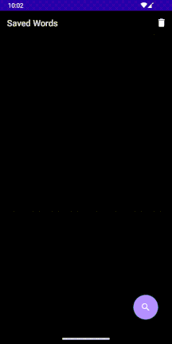

# Dictionary app with local caching and bookmark feature
 

## Introduction
A simple yet very useful dictionary app I made while learning MVVM. The goal was not just to use it as a learning opportunity but also to create something practical that I'd want to use myself. I have a habit of looking up things whenever I encounter something I don't understand, especially words. I find myself constantly taking out my phone and looking up new words I come across. While the dictionary apps are great, I find many of them overloaded with features and hard to navigate. Personally, all I need is something that allows me to do a quick lookup and store a list that reminds me： "Hey, you've looked this one up many times. How about trying to memorize it?". Therefore I decided that making a dictionary app would be a good idea. 

## Features

- Search feature that fetchs word data from remote data source and caches to local database.
- Search suggestion that updates dynamically
- Audio playback for pronounciation
- Bookmark words for easy access.
- Priority level and displaying saved words ordered by priority
- Add notes to words.
- Swipe to delete saved words from bookmark list.

## Screenshots
bookmark:

offline:

insert note:

delete bookmark:

changing priority level:

## Technical stuffs
- Built with MVVM(Model-View-ViewModel) architectural pattern which separates UI, business logic and data. The UI contains minimal business logic and doesn't directly interact with the datasource. Instead it observes Livedata and updates in real time. Viewmodels handle the logic and interact with the data layer where the repository fetch data from either network or local database. This way when UI gets destroyed during configuration changes and data remains unaffected.
- Followed single-source-of-truth principle. The data always comes from the local database. When a query is made, it first checks if data exists locally, if not it then fetches from network and stores the data into local cache, where the data then gets sent to the UI as livedata.
- Room persistence library used for local data caching.
- Retrofit used for fectching data from REST API
- Material design used for UI

## API used
- The awesome free dictionary api: https://dictionaryapi.dev/

## Limitations and things to improve
- There is a bug where somtimes the search suggestion doesn't always update correctly when fetching from network and requires manual update by changing the query text.
- Should probably add a loading animation while fetching data from network.
- Implement pagination for search list
- Maybe it's better to replace swipe to delete with a hold to delete feature

## Challenges
- The implementation of MVVM can be quite challaneging at first, but I did start to see the huge benefit it has during the process of building this project.
- I decided to write everything in Java because it's the language I'm more familiar with and I believe learning to do it in java helps me better understand the legacy code. However, looking in hindsight, doing so in 2023 probably wasn't the best choice due to the fact Google has been trying very hard to push Kotlin that some of the resources and documentation for Java are either oudated or removed and for some reason available in only cerntain languages. 

